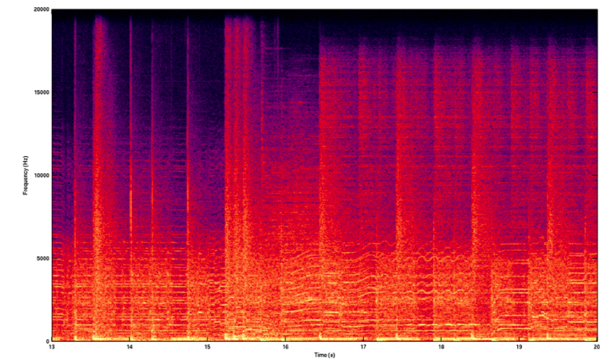
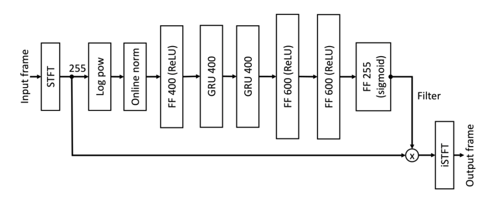

# Введение.

Обработка звука - это процесс исследования динамической/статической звуковой дорожки при помощи применения определенного набора линейных и нелинейных алгоритмов с целью получения необходимой информации. Данный процесс происходит с использованием компьютерных программ и зачастую сопровождается трудными техническими вычислениями, которые ложатся на вычислительные мощности компьютера или на отдельные его комплектующие части. 

Процесс исследования и обработки звукова так или иначе присутствует в разных сферах профессиональной деятельности, будь то голосовые помощники, встроенные в мобильные устройства или любые другие девайсы, индустрия профессионального бизнес-сообщества для фиксирования необходимой информации  или же специальные службы, использующие самые современные технологии для расследования преступлений. 

Если мы говорим о задаче обработки звука, то чаще всего имеем в виду применение к звуковой дорожке определенного набора стандартных и собственных алгоритмов, которые позволяют получить определенный срез информации о дорожке или же получить новую трансформированную аудио дорожку.

Цель данной работы – реализовать алгоритмы удаления посторонних шумов из аудио дорожки и разделения дорожки на несколько говорящих.

Чтобы достигнуть поставленной цели, требуется решить следующие задачи:

1) реализовать алгоритм определения основных действующих линий в звуковой дорожке;

2) выбрать стандартные алгоритмы удаления шумов для каждой действующей линии;

3) к выбранному стандартному алгоритму удаления шумов добавить собственную нейронную сеть, изменяющую коэффициенты “очистки” дорожки от шумов в процессе ее жизни;

4) разработать программное обеспечение, которое позволит преобразовать разделенные и очищенные от шумов аудио дорожки в текстовые файлы.

# 1. Аналитическая часть

	В данной части производится анализ и сравнение методов и алгоритмов предметной области, необходимых для выполнения поставленной задачи. 

## 1.1 Постановка задачи

	Разработать программу исследования и преобразования звуковой дорожки. Программа должна поддерживать следующие функции: добавление звуковой дорожки; очистка звуковой дорожки от шумов; разделение звуковой дорожки на несколько говорящих; выделение из звуковой дорожки сказанного текста. Можно выделить следующие задачи: 

* чтение аудиодорожки в формате .mp3; 
* удаление шумов из аудиодорожки; 
* разделение одной аудиодорожки на несколько по количеству выявленных говорящих; 
* распознавание русского текста в аудио дорожке и его запись в файл; 

## 1.2 Представление звука в компьютере

Записанный звук состоит из множества звуковых волн, одновременно попадающих на датчик микрофона в некоторый промежуток времени, в результате чего мы получаем длинный вектор из чисел - это амплитуды (громкость) сигнала в течение небольшого времени. Частота сигнала проводного телефона 8kHz, это значит что мы за секунду 8000 раз измеряем амплитуду (громкость) суммарного сигнала, звуковые карты как правило используют частоту 44.1 или 48kHz. 

Наша последовательность является суммой множества звуковых волн, и мы можем вычислить какие волны приняли участи в нашей сумме. Теоретически, любой сложный звук может быть разложен на последовательность простейших гармонических сигналов разных частот, каждый из которых представляет собой правильную синусоиду и может быть описан числовыми параметрами.

Чтобы делать с аудио сложные вещи, такие как распознавание человека по голосу, перевод речи речи в текст или удаление шума с помощью глубокого обучения, нужно вычислить вклад различных частот в аудиопоследовательность — **спектр**. **Спектр** можно представить в виде спектрограммы — изображения, показывающего зависимостьамплитуды сигнала во времени на различных частотах. Один столбец в спектрограмме соответствует спектру короткого участка исходного сигнала, более тёплые тона означают большее значение. 

Спектр для спектрограммы можно вычислить с помощью дискретного преобразования Фурье (см. п. 1.6 Алгоритм Фурье), реализованного в библиотеке Numpy. Функция Stft проводит преобразование Фурье. Массив делится на части определённой длины (рассчитанной в calcSpec) и для каждой из частей применяется функция преобразования Фурье, взятая из Numpy возвращает готовую спектрограмму. (пример см. Рисунок 1.2.1)

>>>>>  gd2md-html alert: inline image link here (to images/image1.png). Store image on your image server and adjust path/filename/extension if necessary.  (<a href="#">Back to top</a>)(<a href="#gdcalert2">Next alert</a>) >>>>> 

Рисунок 1.2.1: Пример спектрограммы, полученной из звукового файла, при помощи библиотеки Numpy.

## 1.3 Удаление шума и модель NSNet2

Звуковой сигнал, записываемый в реальных акустических условиях, часто содержит нежелательные шумы, которые могут порождаться окружающей средой или звукозаписывающей аппаратурой. Значит, полученное цифровое описание также будет содержать нежелательные шумы.

Также важной функцией является calcFeat, позволяющая нам прологарифмировать спектрограмму, растягивая нижние частоты и сжимая верхние. Голос человека лежит в диапазоне 85-3000Гц, а диапазон звуковых частот в нашей записи 16кГц — маленький промежуток на всем диапазоне, и помощью логарифмирования мы “растягиваем” нужные нам низкие частоты и “поджимаем” ненужные высокие.

Чтобы “очистить” звук, к цифровому описанию необходимо применить фильтр, который убирает нежелательные шумы. Но возникает другая проблема. Каждый из видов шумов требует свой фильтр, который необходимо подбирать вручную или искать в банках данных фильтров. Отфильтровать шум на частотах, отличающихся от человеческой речи, проблем нет, от них избавлялись еще до этих ваших нейросетей. А вот убрать детский плач или стучание клавиш без значительного ухудшения качества голоса было проблематично.

В решении данной проблемы могут помочь модели глубокого обучения. Основное преимущество нейросетей перед заранее подготовленными фильтрами заключается в большем охвате различных видов шумов. Нейросеть можно натренировать, постоянно добавляя всё новые виды шума.

В нашем случае мы воспользуемся моделью NSNet2. Эта нейронная сеть использовалась компанией Microsoft. Целью разработки данной сети было создание модели для очистки звука от шума в реальном времени. Данная модель состоит из полносвязного слоя с ReLU, двух рекуррентных GRU (Gated Recurrent Unit) блоков и полносвязных слоев (FF, feed forward) с ReLU и sigmoid активацией. 

>>>>>  gd2md-html alert: inline image link here (to images/image2.png). Store image on your image server and adjust path/filename/extension if necessary.  (<a href="#">Back to top</a>)(<a href="#gdcalert3">Next alert</a>) >>>>> 

Рисунок 1.2.1: Пример спектрограммы, полученной из звукового файла, при помощи библиотеки Numpy.

На речь влияет большое количество внешних условий. Человек может говорить громко или тихо, быстро или медленно, говорить он может в большой комнате или в маленькой, далеко от микрофона или близко к нему. Для моделирования этих более сложных условий, были применены аугментации. В частности, в данном случае, для модификации звука использовались случайные биквадратные фильтры. Благодаря применения таких аугментаций, зашумление звука наиболее приближено к реальным условиям.

Представленные результаты по качеству работы можно посмотреть в статье [Data augmentation and loss normalization for deep noise suppression](https://arxiv.org/pdf/2008.06412.pdf). Построенная модель имеет хорошие показатели для различных типов шума.

## 1.4 Конвертация модели в OpenVINO

OpenVINO (Open Visual Inference & Neural Network Optimization) - продукт, разрабатываемый компанией Intel. Как видно из названия, OpenVINO - это набор инструментов для исполнения и оптимизации нейронных сетей.

Существует множество фреймворков для создания и тренировки нейросетей. Для того, чтобы можно было запускать нейросети из различных фреймворков на любом интеловском железе, в составе OpenVINO есть модуль Model Optimizer.

По факту, Model Optimizer - это набор python-скриптов, которые позволяют привести нейронные сети различных форматов к некоторому универсальному представлению, называемому IR (Intermediate Representation). Это позволяет OpenVINO работать с любой нейросетью, независимо от того, из какого фреймворка она взята.

В процессе своей работы Model Optimizer также оптимизирует структуру сверточных нейронных сетей. Например, объединяя результаты сверток, заменяя слои на последовательность линейных операций и т.д.

	В последнее время, с появлением API, в Model Optimizer проводится все меньше оптимизаций, и основная его работа сводится к конвертации моделей без каких-либо серьезных изменений.

Конвертация в IR-представление различается для моделей из Open Model Zoo и других моделей. Open Model Zoo – репозиторий глубоких нейросетевых моделей, содержащий большое количество обученных моделей, которые могут исполняться при помощи OpenVINO. Данный репозиторий хранит не только модели, но и параметры для конвертации моделей из разных фреймворков в промежуточный формат OpenVINO.

## 1.6 Алгоритм Фурье

**Быстрое преобразование Фурье** (_БПФ_, _FFT_) — алгоритм ускоренного вычисления дискретного преобразования Фурье, позволяющий получить результат за время, меньшее чем 

>>>>>  gd2md-html alert: equation: use MathJax/LaTeX if your publishing platform supports it.  (<a href="#">Back to top</a>)(<a href="#gdcalert4">Next alert</a>) >>>>> 

 (требуемого для прямого, поформульного вычисления). 

	При применении основного алгоритма дискретное преобразование Фурье может быть выполнено за 

>>>>>  gd2md-html alert: equation: use MathJax/LaTeX if your publishing platform supports it.  (<a href="#">Back to top</a>)(<a href="#gdcalert5">Next alert</a>) >>>>> 

 действий при 

>>>>>  gd2md-html alert: equation: use MathJax/LaTeX if your publishing platform supports it.  (<a href="#">Back to top</a>)(<a href="#gdcalert6">Next alert</a>) >>>>> 

.

Дискретное преобразование Фурье преобразует набор чисел  

>>>>>  gd2md-html alert: equation: use MathJax/LaTeX if your publishing platform supports it.  (<a href="#">Back to top</a>)(<a href="#gdcalert7">Next alert</a>) >>>>> 

  в набор чисел  

>>>>>  gd2md-html alert: equation: use MathJax/LaTeX if your publishing platform supports it.  (<a href="#">Back to top</a>)(<a href="#gdcalert8">Next alert</a>) >>>>> 

, такой что  

>>>>>  gd2md-html alert: equation: use MathJax/LaTeX if your publishing platform supports it.  (<a href="#">Back to top</a>)(<a href="#gdcalert9">Next alert</a>) >>>>> 

, где 

>>>>>  gd2md-html alert: equation: use MathJax/LaTeX if your publishing platform supports it.  (<a href="#">Back to top</a>)(<a href="#gdcalert10">Next alert</a>) >>>>> 

- первообразный корень из единицы, то есть 

>>>>>  gd2md-html alert: equation: use MathJax/LaTeX if your publishing platform supports it.  (<a href="#">Back to top</a>)(<a href="#gdcalert11">Next alert</a>) >>>>> 

 и 

>>>>>  gd2md-html alert: equation: use MathJax/LaTeX if your publishing platform supports it.  (<a href="#">Back to top</a>)(<a href="#gdcalert12">Next alert</a>) >>>>> 

 Основной шаг алгоритма состоит в сведении задачи для 

>>>>>  gd2md-html alert: equation: use MathJax/LaTeX if your publishing platform supports it.  (<a href="#">Back to top</a>)(<a href="#gdcalert13">Next alert</a>) >>>>> 

 чисел к задаче с меньшим числом. Для  

>>>>>  gd2md-html alert: equation: use MathJax/LaTeX if your publishing platform supports it.  (<a href="#">Back to top</a>)(<a href="#gdcalert14">Next alert</a>) >>>>> 

 над полем комплексных чисел вводятся:  

>>>>>  gd2md-html alert: equation: use MathJax/LaTeX if your publishing platform supports it.  (<a href="#">Back to top</a>)(<a href="#gdcalert15">Next alert</a>) >>>>> 

, где 

>>>>>  gd2md-html alert: equation: use MathJax/LaTeX if your publishing platform supports it.  (<a href="#">Back to top</a>)(<a href="#gdcalert16">Next alert</a>) >>>>> 

Дискретное преобразование Фурье может быть представлено в виде 

>>>>>  gd2md-html alert: inline image link here (to images/image3.png). Store image on your image server and adjust path/filename/extension if necessary.  (<a href="#">Back to top</a>)(<a href="#gdcalert17">Next alert</a>) >>>>> 

. 

(Эти выражения могут быть легко получены, если исходную сумму разбить на меньшее число сумм с меньшим числом слагаемых, а после полученные суммы привести к одинаковому виду путём сдвига индексов и их последующего переобозначения).

Таким образом:

    

>>>>>  gd2md-html alert: inline image link here (to images/image4.png). Store image on your image server and adjust path/filename/extension if necessary.  (<a href="#">Back to top</a>)(<a href="#gdcalert18">Next alert</a>) >>>>> 

.

С учётом того, что 

>>>>>  gd2md-html alert: inline image link here (to images/image5.png). Store image on your image server and adjust path/filename/extension if necessary.  (<a href="#">Back to top</a>)(<a href="#gdcalert19">Next alert</a>) >>>>> 

и 

>>>>>  gd2md-html alert: inline image link here (to images/image6.png). Store image on your image server and adjust path/filename/extension if necessary.  (<a href="#">Back to top</a>)(<a href="#gdcalert20">Next alert</a>) >>>>> 

, окончательная запись:

    

>>>>>  gd2md-html alert: inline image link here (to images/image7.png). Store image on your image server and adjust path/filename/extension if necessary.  (<a href="#">Back to top</a>)(<a href="#gdcalert21">Next alert</a>) >>>>> 

.

Далее вычисляется каждое 

>>>>>  gd2md-html alert: equation: use MathJax/LaTeX if your publishing platform supports it.  (<a href="#">Back to top</a>)(<a href="#gdcalert22">Next alert</a>) >>>>> 

, где 

>>>>>  gd2md-html alert: equation: use MathJax/LaTeX if your publishing platform supports it.  (<a href="#">Back to top</a>)(<a href="#gdcalert23">Next alert</a>) >>>>> 

, здесь по-прежнему требуется совершить O(N) действий, то есть на этом этапе производится 

>>>>>  gd2md-html alert: equation: use MathJax/LaTeX if your publishing platform supports it.  (<a href="#">Back to top</a>)(<a href="#gdcalert24">Next alert</a>) >>>>> 

 операций.

Далее считается  

>>>>>  gd2md-html alert: equation: use MathJax/LaTeX if your publishing platform supports it.  (<a href="#">Back to top</a>)(<a href="#gdcalert25">Next alert</a>) >>>>> 

, где 

>>>>>  gd2md-html alert: equation: use MathJax/LaTeX if your publishing platform supports it.  (<a href="#">Back to top</a>)(<a href="#gdcalert26">Next alert</a>) >>>>> 

. При замене 

>>>>>  gd2md-html alert: equation: use MathJax/LaTeX if your publishing platform supports it.  (<a href="#">Back to top</a>)(<a href="#gdcalert27">Next alert</a>) >>>>> 

 в последней формуле, выражения, стоящие в скобках, остались неизменными, а так как они уже были посчитаны на предыдущем шаге, то на вычисление каждого из них потребуется только 

>>>>>  gd2md-html alert: equation: use MathJax/LaTeX if your publishing platform supports it.  (<a href="#">Back to top</a>)(<a href="#gdcalert28">Next alert</a>) >>>>> 

 действий. Всего p(q-1) = N - p чисел. Следовательно, операций на этом шаге 

>>>>>  gd2md-html alert: equation: use MathJax/LaTeX if your publishing platform supports it.  (<a href="#">Back to top</a>)(<a href="#gdcalert29">Next alert</a>) >>>>> 

. Последнее с хорошей точностью верно при любых 

>>>>>  gd2md-html alert: equation: use MathJax/LaTeX if your publishing platform supports it.  (<a href="#">Back to top</a>)(<a href="#gdcalert30">Next alert</a>) >>>>> 

.

Алгоритм быстрого преобразования Фурье логично применять для 

>>>>>  gd2md-html alert: equation: use MathJax/LaTeX if your publishing platform supports it.  (<a href="#">Back to top</a>)(<a href="#gdcalert31">Next alert</a>) >>>>> 

, потому как при малом числе отсчетов он дает небольшой выигрыш в скорости по отношению к прямому расчету дискретного преобразования Фурье. Таким образом, для того чтобы полностью перейти к набору чисел 

>>>>>  gd2md-html alert: equation: use MathJax/LaTeX if your publishing platform supports it.  (<a href="#">Back to top</a>)(<a href="#gdcalert32">Next alert</a>) >>>>> 

, необходимо 

>>>>>  gd2md-html alert: equation: use MathJax/LaTeX if your publishing platform supports it.  (<a href="#">Back to top</a>)(<a href="#gdcalert33">Next alert</a>) >>>>> 

 действий. Следовательно, нет разницы, на какие два числа разбивать 

>>>>>  gd2md-html alert: equation: use MathJax/LaTeX if your publishing platform supports it.  (<a href="#">Back to top</a>)(<a href="#gdcalert34">Next alert</a>) >>>>> 

 — ответ от этого сильно не будет меняться. Уменьшено же число операций может быть только дальнейшим разбиением 

 

>>>>>  gd2md-html alert: equation: use MathJax/LaTeX if your publishing platform supports it.  (<a href="#">Back to top</a>)(<a href="#gdcalert35">Next alert</a>) >>>>> 

.

Скорость алгоритма 

>>>>>  gd2md-html alert: equation: use MathJax/LaTeX if your publishing platform supports it.  (<a href="#">Back to top</a>)(<a href="#gdcalert36">Next alert</a>) >>>>> 

 :

1.  

>>>>>  gd2md-html alert: equation: use MathJax/LaTeX if your publishing platform supports it.  (<a href="#">Back to top</a>)(<a href="#gdcalert37">Next alert</a>) >>>>> 

 
2. 

>>>>>  gd2md-html alert: equation: use MathJax/LaTeX if your publishing platform supports it.  (<a href="#">Back to top</a>)(<a href="#gdcalert38">Next alert</a>) >>>>> 

3. 

>>>>>  gd2md-html alert: equation: use MathJax/LaTeX if your publishing platform supports it.  (<a href="#">Back to top</a>)(<a href="#gdcalert39">Next alert</a>) >>>>> 

То есть число операций при любом разбиении 

>>>>>  gd2md-html alert: equation: use MathJax/LaTeX if your publishing platform supports it.  (<a href="#">Back to top</a>)(<a href="#gdcalert40">Next alert</a>) >>>>> 

 на два числа, есть 

>>>>>  gd2md-html alert: equation: use MathJax/LaTeX if your publishing platform supports it.  (<a href="#">Back to top</a>)(<a href="#gdcalert41">Next alert</a>) >>>>> 

, где 

>>>>>  gd2md-html alert: equation: use MathJax/LaTeX if your publishing platform supports it.  (<a href="#">Back to top</a>)(<a href="#gdcalert42">Next alert</a>) >>>>> 

.

>>>>>  gd2md-html alert: inline image link here (to images/image8.png). Store image on your image server and adjust path/filename/extension if necessary.  (<a href="#">Back to top</a>)(<a href="#gdcalert43">Next alert</a>) >>>>> 

Рисунок 1.7.1: Амплитуды быстрого преобразования Фурье для разного количества компонент разложения N. Первый случай: N=L-10, где L — количество отсчетов сигнала; второй случай: N = L; третий: N = L + 10. В первом и последних случаях спектральные характеристики оцениваются менее точно. Данный эффект связан с явлением Гиббс.

## 1.7 Преобразование голоса в текст: Распознавание речи

### 1.7.1 Разбиение слов

Первой задачей, которую приходится решать при распознавании речи, является разбиение этой самой речи на отдельные слова. Для простоты предположим, что в нашем случае речь содержит в себе некоторые паузы (промежутки тишины), которые можно считать “разделителями” слов.

В таком случае нам нужно найти некоторое значение, порог — значения выше которого являются словом, ниже — тишиной. Вариантов тут может быть несколько:

* задать константой (сработает, если исходный сигнал всегда генерируется при одних и тех же условиях, одним и тем же способом);
* кластеризовать значения сигнала, явно выделив множество значений соответствующих тишине (сработает только если тишина занимает значительную часть исходного сигнала);
* проанализировать энтропию;

Как вы уже догадались, речь сейчас пойдёт о последнем пункте :) Начнём с того, что энтропия — это мера беспорядка, “мера неопределённости какого-либо опыта” (с). В нашем случае энтропия означает то, как сильно “колеблется” наш сигнал в рамках заданного фрейма.

Для того, что бы подсчитать энтропию конкретного фрейма выполним следующие действия:

* предположим, что наш сигнал пронормирован и все его значения лежат в диапазоне [-1;1];
* построим гистограмму (плотность распределения) значений сигнала фрейма:

рассчитаем энтропию, как 

>>>>>  gd2md-html alert: inline image link here (to images/image9.png). Store image on your image server and adjust path/filename/extension if necessary.  (<a href="#">Back to top</a>)(<a href="#gdcalert44">Next alert</a>) >>>>> 

;

### 1.7.2 MFCC

И так, мы у нас есть набор фреймов, соответствующих определенному слову. Мы можем пойти по пути наименьшего сопротивления и в качестве численной характеристики фрейма использовать средний квадрат всех его значений (Root Mean Square). Однако, такая метрика несёт в себе крайне мало пригодной для дальнейшего анализа информации.

MFCC — это своеобразное представление энергии спектра сигнала. Плюсы его использования заключаются в следующем:

* Используется спектр сигнала (то есть разложение по базису ортогональных [ко]синусоидальных функций), что позволяет учитывать волновую “природу” сигнала при дальнейшем анализе;
* Спектр проецируется на специальную mel-шкалу, позволяя выделить наиболее значимые для восприятия человеком частоты;
* Количество вычисляемых коэффициентов может быть ограничено любым значением (например, 12), что позволяет “сжать” фрейм и, как следствие, количество обрабатываемой информации;

### 1.7.3 Разложение в ряд Фурье

Первым делом рассчитываем спектр сигнала с помощью дискретного преобразования Фурье (желательно его “быстрой” FFT реализацией).

>>>>>  gd2md-html alert: inline image link here (to images/image10.png). Store image on your image server and adjust path/filename/extension if necessary.  (<a href="#">Back to top</a>)(<a href="#gdcalert45">Next alert</a>) >>>>> 

Так же к полученным значениям рекомендуется применить оконную функцию Хэмминга, чтобы “сгладить” значения на границах фреймов.

>>>>>  gd2md-html alert: inline image link here (to images/image11.png). Store image on your image server and adjust path/filename/extension if necessary.  (<a href="#">Back to top</a>)(<a href="#gdcalert46">Next alert</a>) >>>>> 

То есть результатом будет вектор следующего вида:

>>>>>  gd2md-html alert: inline image link here (to images/image12.png). Store image on your image server and adjust path/filename/extension if necessary.  (<a href="#">Back to top</a>)(<a href="#gdcalert47">Next alert</a>) >>>>> 

Важно понимать, что после этого преобразования по оси Х мы имеем частоту (hz) сигнала, а по оси Y — магнитуду (как способ уйти от комплексных значений):

>>>>>  gd2md-html alert: inline image link here (to images/image13.png). Store image on your image server and adjust path/filename/extension if necessary.  (<a href="#">Back to top</a>)(<a href="#gdcalert48">Next alert</a>) >>>>> 

Рисунок 1.7.3.1: Пример голосовых волн и их спектр

### 1.7.4 Расчет mel-фильтров

Начнём с того, что такое mel. Опять же согласно Википедии, mel — это “психофизическая единица высоты звука”, основанная на субъективном восприятии среднестатистическими людьми. Зависит в первую очередь от частоты звука (а также от громкости и тембра). Другими словами, эта величина, показывающая, на сколько звук определённой частоты “значим” для нас.

Преобразовать частоту в мел можно по следующей формуле (запомним ее как «формула-1»):

>>>>>  gd2md-html alert: inline image link here (to images/image14.png). Store image on your image server and adjust path/filename/extension if necessary.  (<a href="#">Back to top</a>)(<a href="#gdcalert49">Next alert</a>) >>>>> 

Обратное преобразование выглядит так (запомним ее как «формула-2»):

>>>>>  gd2md-html alert: inline image link here (to images/image15.png). Store image on your image server and adjust path/filename/extension if necessary.  (<a href="#">Back to top</a>)(<a href="#gdcalert50">Next alert</a>) >>>>> 

Получаем график зависимости mel / частота (см. Рисунок 1.7.4.1).

>>>>>  gd2md-html alert: inline image link here (to images/image16.png). Store image on your image server and adjust path/filename/extension if necessary.  (<a href="#">Back to top</a>)(<a href="#gdcalert51">Next alert</a>) >>>>> 

Рисунок 1.7.4.1: График зависимости mel / частота

Допустим у нас есть фрейм размером 256 элементов. Мы знаем (из данных об аудиоформате), что частота звука в данной фрейме 16000hz. Предположим, что человеческая речь лежит в диапазоне от [300; 8000]hz. Количество искомых мел-коэффициентов положим M = 10 (рекомендуемое значение).

Для того, что бы разложить полученный выше спектр по mel-шкале, нам потребуется создать “гребенку” фильтров. По сути, каждый mel-фильтр это треугольная оконная функция, которая позволяет просуммировать количество энергии на определенном диапазоне частот и тем самым получить mel-коэффициент. Зная количество мел-коэффициентов и анализируемый диапазон частот мы можем построить набор таких вот фильтров (см. Рисунок 1.7.4.2).

>>>>>  gd2md-html alert: inline image link here (to images/image17.png). Store image on your image server and adjust path/filename/extension if necessary.  (<a href="#">Back to top</a>)(<a href="#gdcalert52">Next alert</a>) >>>>> 

Рисунок 1.7.4.2: Набор фильтров

Чем больше порядковый номер мел-коэффициента, тем шире основание фильтра. Это связано с тем, что разбиение интересующего нас диапазона частот на обрабатываемые фильтрами диапазоны происходит на шкале мелов.

Для нашего случая диапазон интересующих нас частот равен [300, 8000]. Согласно формуле-1 в на мел-шкале этот диапазон превращается в [401.25; 2834.99].

Далее, для того, что бы построить 10 треугольных фильтров нам потребуется 12 опорных точек:

m[i] = [401.25, 622.50, 843.75, 1065.00, 1286.25, 1507.50, 1728.74, 1949.99, 2171.24, 2392.49, 2613.74, 2834.99]

На мел-шкале точки расположены равномерно. Переведем шкалу обратно в герцы с помощью формулы-2:

h[i] = [300, 517.33, 781.90, 1103.97, 1496.04, 1973.32, 2554.33, 3261.62, 4122.63, 5170.76, 6446.70, 8000]

Теперь шкала стала постепенно растягиваться, выравнивая тем самым динамику роста “значимости” на низких и высоких частотах.

Теперь нам нужно наложить полученную шкалу на спектр нашего фрейма. Как мы помним, по оси Х у нас находится частота. Длина спектра 256 — элементов, при этом в него умещается 16000hz. Решив нехитрую пропорцию можно получить следующую формулу:

f(i) = floor( (frameSize+1) * h(i) / sampleRate)

что в нашем случае эквивалентно

f(i) = 4, 8, 12, 17, 23, 31, 40, 52, 66, 82, 103, 128

Зная опорные точки на оси Х нашего спектра, легко построить необходимые нам фильтры по следующей формуле:

>>>>>  gd2md-html alert: inline image link here (to images/image18.png). Store image on your image server and adjust path/filename/extension if necessary.  (<a href="#">Back to top</a>)(<a href="#gdcalert53">Next alert</a>) >>>>> 

### 1.7.5 Логарифмирование энергии спектра

Применение фильтра заключается в попарном перемножении его значений со значениями спектра. Результатом этой операции является mel-коэффициент. Поскольку фильтров у нас M, коэффициентов будет столько же.

>>>>>  gd2md-html alert: inline image link here (to images/image19.png). Store image on your image server and adjust path/filename/extension if necessary.  (<a href="#">Back to top</a>)(<a href="#gdcalert54">Next alert</a>) >>>>> 

Однако, нам нужно применить mel-фильтры не к значениям спектра, а к его энергии. После чего прологарифмировать полученные результаты. Считается, что таким образом снижается чувствительность коэффициентов к шумам.

### 1.7.6 Косинусное преобразование

Дискретное косинусное преобразование (DCT) используется для того, чтобы получить те самые “кепстральные” коэффициенты. Смысл его в том, чтобы “сжать” полученные результаты, повысив значимость первых коэффициентов и уменьшив значимость последних.

В данном случае используется DCTII без каких-либо домножений на 

>>>>>  gd2md-html alert: inline image link here (to images/image20.png). Store image on your image server and adjust path/filename/extension if necessary.  (<a href="#">Back to top</a>)(<a href="#gdcalert55">Next alert</a>) >>>>> 

 (scale factor).

>>>>>  gd2md-html alert: inline image link here (to images/image21.png). Store image on your image server and adjust path/filename/extension if necessary.  (<a href="#">Back to top</a>)(<a href="#gdcalert56">Next alert</a>) >>>>> 

Теперь для каждого фрейма мы имеем набор из M mfcc-коэффициентов, которые могут быть использованы для дальнейшего анализа.

## 1.8 Выводы из аналитического раздела

	В данном разделе были описаны: представление звука в компьютере, конвертация модели OpenVINO, модель NSNet2, алгоритм Фурье, Алгоритм распознавания речи.

Надо отметить, что проблема шумоподавления до сих пор не решена полностью. Методике улучшения речи с помощью нейронных сетей в последнее время уделяется огромное внимание как в научных исследованиях, так и в коммерческих приложениях. Одним из важнейших преимуществ использования нейронных сетей для подавления шума является то, что они способны очищать звук от нестационарных шумов. Ранее известные подходы не позволяли этого сделать.